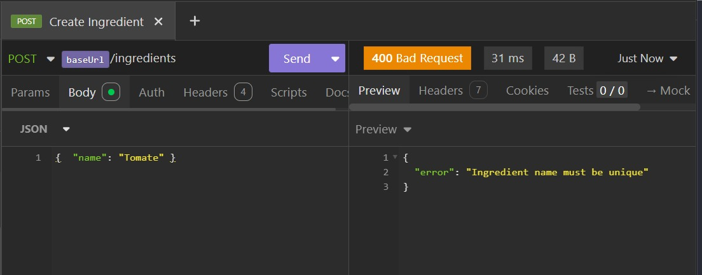
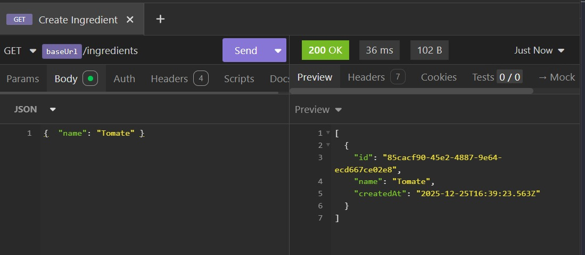

# Testes - Ingrediente

## Criar ingrediente
Endpoint: POST /ingredients

Resultado: ingrediente criado com sucesso.

---

## Listar ingredientes
Endpoint: GET /ingredients

Resultado: ingrediente listado corretamente.

